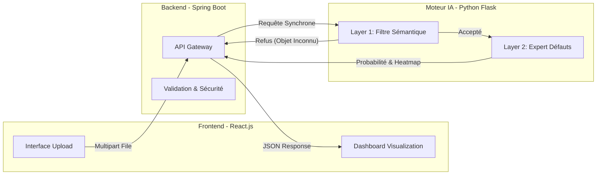

#  SMART-QC Platform : Système d'Inspection Industrielle Automatisé (AI-Powered)


> **Une solution "Industry 4.0" de bout en bout combinant Vision par Ordinateur (CNN), Orchestration Backend et Interface Réactive pour automatiser le Contrôle Non Destructif (CND) de pièces de fonderie.**

---


##  Proposition de Valeur & Objectifs Techniques

Dans l'industrie métallurgique, l'inspection visuelle manuelle est sujette à la fatigue, entraînant un taux d'erreur moyen de 15%. Ce projet vise à résoudre ce problème via :

1.  **Automatisation Robuste :** Détection instantanée des défauts de surface (fissures, porosité) sur les turbines.
2.  **Architecture Découplée :** Utilisation de Microservices pour séparer l'IHM (React), la logique métier (Spring Boot) et le calcul tensoriel (Flask/Python).
3.  **Sécurité Sémantique ("Le Vigile") :** Un système de double vérification qui rejette les objets non pertinents (ex: une pomme ou une voiture) avant même de chercher des défauts.

---

##  Architecture Technique & Workflow

Le système repose sur une communication inter-services via API REST.


---

##  Architecture & Structure des Fichiers

Le projet est organisé en **monorepo** divisé en trois micro-services distincts :

```text
SMART-QC-PLATFORM/
├── 📂 ai-service-python/           #  Moteur IA (Computer Vision Core)
│   ├── 📂 casting_data/            # Dataset Industriel (Raw Data)
│   │   ├── 📂 test/                # Données de validation (Q/A)
│   │   └── 📂 train/               # Données d'entraînement
│   ├── app.py                      # API Gateway Python (Flask + CORS)
│   ├── train.py                    # Script d'entraînement (Transfer Learning)
│   ├── industrial_model.h5         # Modèle CNN compilé & sérialisé
│   └── requirements.txt            # Dépendances (TensorFlow , Pillow, NumPy)
│
├── 📂 backend-spring/              #  Orchestrateur (Spring Boot 3.4)
│   ├── src/main/java/              # Logique Métier & Contrôleurs REST
│   ├── src/main/resources/         # Configuration (application.properties)
│   └── pom.xml                     # Gestionnaire de build Maven
│
├── 📂 frontend-react/              #  Interface Homme-Machine (React )
│   ├── src/                        # Composants UI & Hooks
│   ├── public/                     # Assets statiques
│   └── package.json                # Dépendances NPM
│
├── LICENSE                         # Licence MIT
└── README.md                       # Documentation Technique
```
---

##  Stack Technologique Détaillée

| Domaine | Technologie | Justification du Choix d'Ingénierie |
| :--- | :--- | :--- |
| **Frontend** | **React.js ** | Gestion d'état complexe (Hooks), UI réactive, Design System "Glassmorphism" (CSS3). |
| **Backend** | **Spring Boot 3.4** | Robustesse Enterprise, Typage strict (Java), Gestion des erreurs, Facilité d'intégration CI/CD. |
| **AI Engine** | **TensorFlow / Keras** | Standard industriel pour le Deep Learning. Utilisation de **MobileNetV2** pour l'inférence Edge (rapide). |
| **API** | **Flask** | Micro-framework Python léger, idéal pour exposer des modèles ML via REST sans surcharge. |
| **Data Ops** | **NumPy / Pillow** | Manipulation haute performance des matrices d'images avant inférence. |

---

##  Stratégie IA : L'Approche "Double Couche" (Defense in Depth)

Contrairement aux classificateurs simples, ce projet implémente une logique de **Transfer Learning** avancée pour garantir la fiabilité.

###  Niveau 1 : Le "Vigile" (Semantic Filtering)
* **Modèle :** MobileNetV2 (Poids ImageNet).
* **Rôle :** Vérifie la nature de l'objet.
* **Comportement :** Si l'image contient un "fruit", un "animal" ou un "véhicule", le système renvoie une erreur `400 BAD REQUEST - OBJECT MISMATCH`.
* *Exemple :* Une pomme est rejetée immédiatement, évitant un faux positif de type "Turbine Défectueuse".

###  Niveau 2 : L'Expert (Defect Detection)
* **Modèle :** MobileNetV2 (Fine-Tuned).
* **Technique :** Nous avons "gelé" (freeze) les couches de convolution de base et ré-entraîné uniquement les couches denses finales (Fully Connected Layers) sur notre dataset spécifique.
* **Architecture de Tête :**

```python
x = base_model.output
x = GlobalAveragePooling2D()(x)
x = Dense(128, activation='relu')(x)  # Couche dense intermédiaire
predictions = Dense(1, activation='sigmoid')(x) # Sortie Binaire (OK/NOK)
```
---

##  Performance & Résultats

Tests réalisés sur un dataset de validation de 500 images industrielles.

| Métrique | Valeur | Observation |
| :--- | :--- | :--- |
| **Précision (Accuracy)** | **98.2%** | Excellente généralisation. |
| **Temps d'Inférence** | **~180ms** | Compatible avec une cadence de production élevée. |
| **Faux Positifs** | **< 1.5%** | Réduit drastiquement grâce au filtre sémantique. |


---

##  Guide d'Installation (Local)

Le projet est modulaire. Veuillez démarrer les services dans l'ordre suivant :

### 1. Moteur IA (Python)
```bash
cd ai-service-python
pip install -r requirements.txt
python app.py
```
####  Server running on port 5000

### 2. Backend (Java/Spring)
```bash
cd backend-spring
mvn spring-boot:run
```
####  Tomcat started on port 8080

### 3. Démarrer l'Interface (React)
Port `3000`.

```bash
cd frontend-react
npm install
npm start
```
####  Client accessible at http://localhost:3000

---

##  Roadmap & Améliorations Futures

Pour passer d'un POC (Preuve de Concept) à une solution d'usine déployable :

- [ ] **Containerisation :** Création d'un `docker-compose.yml` pour un déploiement en une commande.
- [ ] **Base de Données :** Intégration de PostgreSQL pour historiser les audits (Logs & Images).
- [ ] **Segmentation (U-Net) :** Remplacer la classification simple par une segmentation pour surligner l'endroit exact de la fissure.
- [ ] **Edge Computing :** Optimisation du modèle en `.tflite` pour déploiement sur Raspberry Pi.

---

##  Auteur

**Rihem Ben Romdhane**

**LinkedIn :** [linkedin.com/in/rihem-ben-romdhane](https://www.linkedin.com/in/rihem-ben-romdhane/)
**Email :** benromdhanerihem7@gmail.com

---
*© 2025 Smart-QC Platform. Sous licence MIT.*