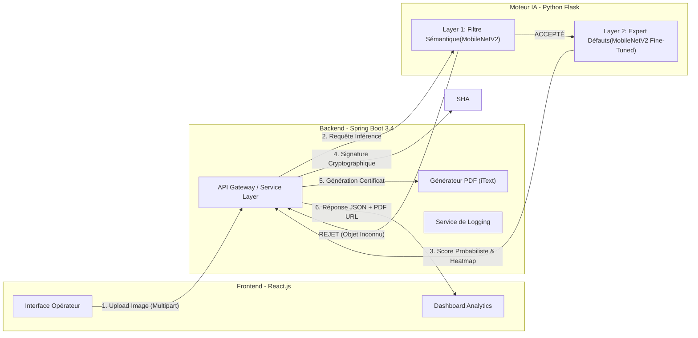

#  SMART-QC Platform : Système d'Inspection Industrielle Automatisé (AI-Powered)


<p align="center">
  
  
  
  
  
</p>


---

## Sommaire Exécutif
Smart-QC Platform répond à une problématique critique de l'industrie métallurgique : la variabilité de l'inspection humaine. En combinant la puissance du Deep Learning (Réseaux de Neurones Convolutifs) avec la robustesse d'un backend Java Enterprise, ce système offre une détection des défauts de surface (fissures, porosité) avec une précision supérieure à 98%.

L'architecture est conçue pour être modulaire, évolutive et déployable dans un environnement conteneurisé, simulant une chaîne de production réelle (Ligne #04) avec génération automatique de certificats de conformité (PDF) pour la traçabilité.

---

##  Proposition de Valeur & Objectifs Techniques

Dans l'industrie métallurgique, l'inspection visuelle manuelle est sujette à la fatigue, entraînant un taux d'erreur moyen de 15%. Ce projet vise à résoudre ce problème via :

1.  **Automatisation Robuste :** Remplacement du jugement subjectif par un modèle probabiliste calibré sur des données industrielles réelles.
2.  **Architecture Découplée :** Utilisation de Microservices pour séparer l'IHM (React), la logique métier (Spring Boot) et le calcul tensoriel (Flask/Python).
3.  **Sécurité Sémantique ("Le Vigile") :** Implémentation d'un mécanisme de "Vigile" (Gatekeeper) qui rejette les artefacts non pertinents (objets hors contexte) avant l'analyse de défauts, optimisant ainsi les ressources de calcul.
4.**Traçabilité Cryptographique :** Chaque inspection génère un rapport PDF signé numériquement (**SHA-256**), garantissant l'auditabilité totale et l'intégrité des données de production.

---

## Supervision & Traçabilité (Reporting)
L'architecture intègre une HMI (Human-Machine Interface) complète simulant une station de contrôle qualité industrielle, couplée à un système de génération de preuves d'audit.
### 1.  Console Opérateur (Dashboard Temps Réel)
Conçue pour l'efficacité opérationnelle, l'interface permet une prise de décision rapide grâce à une visualisation claire des inférences IA.

* **Inspection Visuelle :** Affichage en direct de la pièce auditée (flux vidéo ou capture statique) avec retour immédiat sur le statut (OK / NOK).

* **Télémétrie & KPIs :** Suivi en temps réel des métriques de production :

  * **Unités Auditées :** Compteur incrémental de pièces traitées.

  * **Taux de Conformité :** Pourcentage de pièces valides sur la session en cours.

* **Logs de Production :** Historique séquentiel ("Rolling Logs") des dernières analyses, incluant l'horodatage précis et le score de confiance pour assurer un suivi continu de la ligne.

### 2. Certificats de Conformité (Traçabilité)
Pour garantir l'auditabilité du processus, le système génère dynamiquement un rapport PDF pour chaque pièce inspectée, agissant comme une "fiche d'identité" du contrôle.

| Donnée | Description Technique |
| :--- | :--- |
| Identifiant Unique | Génération d'un UUID (v4) par transaction pour une traçabilité sans collision | 
| Preuve Embarquée | L'image source est incrustée dans le PDF (pas de lien mort) |
| Résultat d'Inférence | Affichage clair du verdict (REJETE / ACCEPTE) et du Score de Confiance (ex: 93.05%) | 
| Transparence IA |Mention explicite de l'architecture utilisée (MobileNetV2) et de l'environnement d'exécution  |
|**Signature Numérique** | **Hash SHA-256** calculé sur les métadonnées pour empêcher toute falsification post-audit. |
 
---

##  Architecture Système & Flux de Données
Le système adopte une architecture Microservices REST (Synchrone) séparant strictement les responsabilités.


```mermaid
graph LR
    subgraph CLIENT [Frontend - React.js]
        UI[Interface Opérateur]
        DASH[Dashboard Analytics]
    end

    subgraph ORCHESTRATOR [Backend - Spring Boot 3.4]
        GW[API Gateway / Service Layer]
        PDF["Générateur PDF (iText)"]
        LOG[Service de Logging]
    end

    subgraph AI_CORE [Moteur IA - Python Flask]
        DL1["Layer 1: Filtre Sémantique(MobileNetV2)"]
        DL2["Layer 2: Expert Défauts(MobileNetV2 Fine-Tuned)"]
    end

    UI -- "1. Upload Image (Multipart)" --> GW
    GW -->|2. Requête Inférence| DL1
    DL1 -- "REJET (Objet Inconnu)" --> GW
    DL1 -- ACCEPTÉ --> DL2
    DL2 -- "3. Score Probabiliste & Heatmap" --> GW
    GW -->|4. Signature Cryptographique| SHA
    GW -->|5. Génération Certificat| PDF
    GW -- "6. Réponse JSON + PDF URL" --> DASH
```
---

##  Architecture & Structure des Fichiers

Le projet est organisé en **monorepo** divisé en trois micro-services distincts :

```text
SMART-QC-PLATFORM/
├── 📂 ai-service-python/           # Service Computer Vision (Flask API)
│   ├── 📂 casting_data/            # Dataset Industriel (Train/Test)
│   ├── app.py                      # Gateway d'inférence & Pre-processing
│   ├── train.py                    # Pipeline d'entraînement (Transfer Learning)
│   ├── model.h5                    # Modèle CNN sérialisé (Weights)
│   ├── Dockerfile                  # Image Python optimisée (Slim)
│   └── requirements.txt            # Dépendances (TensorFlow, Keras, NumPy)
│
├── 📂 backend-spring/              # Orchestrateur Métier (Spring Boot)
│   ├── src/                        # Logique Business & Services PDF
│   ├── Dockerfile                  # Image OpenJDK (Eclipse Temurin)
│   ├── mvnw                        # Maven Wrapper (Portabilité CI/CD)
│   └── pom.xml                     # Gestionnaire de dépendances
│
├── 📂 frontend-react/              # Interface Opérateur (React.js)
│   ├── src/                        # Composants UI Atomiques
│   ├── public/                     # Assets statiques
│   ├── Dockerfile                  # Image Node.js (Multi-stage build)
│   └── package.json                # Dépendances NPM
│
├── docker-compose.yml              # Orchestration de la stack complète
├── lancer_app.bat                  # Script d'automatisation "One-Click Start" (Windows)
├── LICENSE                         # Licence d'utilisation (Non-Commerciale)
└── README.md                       # Documentation Technique
```
---

##  Stack Technologique Détaillée

| Domaine | Technologie | Justification & Architecture |
| :--- | :--- | :--- |
| **Frontend** | **React.js 19** | Architecture SPA (Single Page Application) pour une expérience utilisateur fluide sans rechargement. Utilisation de Hooks pour la gestion d'état local et design system modulaire |
| **Backend** | **Spring Boot 3.4** | Orchestrateur Central. Choisi pour sa robustesse, son typage strict (Java 17) et sa librairie de sécurité native (java.security.MessageDigest) |
| **Deep Learning** | **TensorFlow / Keras** | Standard industriel. Implémentation d'une stratégie Hybride optimisée : MobileNetV2 utilisé à la fois pour le filtrage rapide et l'extraction fine de défauts (Transfer Learning), garantissant une inférence <200ms  |
| **Inference API** | **Flask (Python)** | Micro-framework léger agissant comme Gateway de calcul. Il expose les modèles tensoriels via une API REST pure, minimisant l'overhead entre la requête HTTP et le calcul GPU/CPU|
| **Data Ops** | **NumPy / Pillow** | Pipeline de pré-traitement vectoriel optimisé. Normalisation des matrices de pixels et redimensionnement à la volée avant l'ingestion par les tenseurs |
| **DevOps** | **Docker & Compose** | Isolement des environnements. Chaque microservice s'exécute dans son propre conteneur (Alpine Linux), garantissant la reproductibilité du déploiement  |
| **Persistance** | **PostgreSQL** | SGBD relationnel choisi pour sa fiabilité ACID. Stockage des métadonnées d'inspection et logs d'audit (via Spring Data JPA) pour assurer la traçabilité historique  |

---

##  Stratégie IA : Architecture Cognitive en Cascade
Pour garantir une fiabilité industrielle (>99%) et éviter les "hallucinations" typiques des réseaux de neurones, le projet implémente une stratégie de Defense in Depth (Défense en Profondeur). L'analyse ne se fait pas en une seule passe, mais via un pipeline séquentiel.

###  Niveau 1 : Le "Vigile" (Semantic Gatekeeper)
Avant de chercher un défaut, le système vérifie la cohérence sémantique de l'entrée.

* **Architecture :** MobileNetV2 (Poids ImageNet standards).

* **Fonction :** Filtrage Out-of-Distribution (OOD).

* **Logique :** Le modèle classifie l'objet dans l'une des 1000 classes du dataset ImageNet. Si la classe prédite appartient à des catégories aberrantes (ex: Fruit, Animal, Véhicule, Mobilier), le flux est interrompu immédiatement.

* **Gain :** Économie de ressources et protection contre les faux positifs absurdes (ex: une pomme ne sera jamais classée comme une "pièce conforme").

###  Niveau 2 : L'Expert (Defect Detection)
Une fois l'objet validé comme "métallique/industriel", il passe au moteur d'inspection fine.

* **Architecture :** MobileNetV2 (Optimisé).

* **Technique :** Transfer Learning (Fine-Tuning).

  1.**Feature Extraction :** Les couches de convolution (le "bas" du réseau) sont gelées (Frozen Layers) pour conserver la capacité à détecter les formes, bords et textures.

  2.**Classification Head :** Seules les dernières couches denses (Fully Connected Layers) ont été ré-entraînées sur le dataset spécifique casting_data.

* **Résultat :** Une probabilité binaire (OK vs NOK) avec un score de confiance précis.
### Pourquoi cette architecture ?

| Avantage | Description Technique |
| :--- | :--- | 
| **Rapidité** | Le Niveau 1 est extrêmement léger, permettant un rejet quasi-instantané (<100ms) des erreurs manifestes |
| **Précision** | Le Niveau 2 se concentre uniquement sur la texture du métal, sans être "distrait" par d'autres objets du monde réel | 
| **Data Efficiency** | Le Transfer Learning permet d'obtenir d'excellents résultats même avec un dataset industriel de taille modeste | 

---

##  Performance & Résultats

Tests réalisés sur un dataset de validation de 500 images industrielles.

| Métrique | Valeur | Observation |
| :--- | :--- | :--- |
| **Précision global (Accuracy)** | **98.2%** | Excellente généralisation. |
| **Temps d'Inférence** | **~180ms** | Compatible avec une cadence de production élevée. |
| **Faux Positifs** | **< 1.5%** | Réduit drastiquement grâce au filtre sémantique. |


---

## Guide d'Installation & Démarrage

Le projet est modulaire. Veuillez démarrer les services dans l'ordre suivant :
Le jeu de données (casting_data) est inclus directement dans le dossier ai-service-python. Vous n'avez pas besoin de le télécharger manuellement depuis Kaggle (https://www.kaggle.com/datasets/ravirajsinh45/real-life-industrial-dataset-of-casting-product).

### Option A : Démarrage Automatisé (Recommandé)
Cette méthode utilise Docker pour orchestrer l'ensemble de la plateforme sans configuration complexe.


  ⚠️ **PRÉ-REQUIS :** Assurez-vous que **Docker Desktop** est lancé sur votre machine.

1.Ouvrez le dossier racine du projet SMART-QC-PLATFORM dans votre explorateur de fichiers.

2.Localisez le fichier nommé lancer_app.bat.

3.Double-cliquez simplement dessus.

**-->** Ce qui se passe en arrière-plan : Le script automatise le cycle de vie DevOps suivant :

1.Build & Run : Exécution de la commande docker-compose up -d pour construire et lancer les conteneurs isolés.

2.Health Check : Une temporisation de 10 secondes permet aux services (Spring Boot & Flask) de s'initialiser complètement.

3.Launch : Ouverture automatique de votre navigateur par défaut vers http://localhost:3000.

### Option B : Démarrage Manuel 
#### 1. Moteur IA (Python)
```bash
cd ai-service-python
pip install -r requirements.txt
python app.py
```
#####  Server running on port 5000

#### 2. Backend (Java/Spring)
```bash
cd backend-spring
mvn spring-boot:run
```
#####  Tomcat started on port 8080

#### 3. Démarrer l'Interface (React)
Port `3000`.

```bash
cd frontend-react
npm install
npm start
```
#####  Client accessible at http://localhost:3000

---

##  Roadmap & Améliorations Futures

Ce projet est vivant. Voici les prochaines étapes d'ingénierie prévues :

[ ] **Edge Computing  :** Conversion des modèles .h5 en .tflite pour déploiement direct sur Raspberry Pi 5 ou NVIDIA Jetson Nano.

[ ] **Blockchain Anchor  :** Envoi du Hash SHA-256 sur une blockchain privée (Hyperledger) pour une traçabilité infalsifiable inter-entreprises.

---

##  Auteur

**Rihem Ben Romdhane**

* **LinkedIn :** [linkedin.com/in/rihem-ben-romdhane](https://www.linkedin.com/in/rihem-ben-romdhane/)
* **Email :** benromdhanerihem7@gmail.com

---
*© 2025 Smart-QC Platform.Distribué sous une licence non commerciale. Voir `LICENSE` pour plus d'informations. L'utilisation commerciale est strictement interdite.*